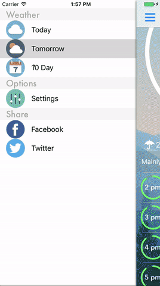

# Rideable

iOS application to provide riders with customizable weather information relevant to their personal preference and location.



## Instructions
* Place your personal API key for [WundergroundWeather] within a file named `IgnoreConstants.swift`.
```swift
import Foundation

struct IgnoreConstants{
static let apiKey = ""
}
```

### Libraries Used
* [SwiftLocation] - Efficient and Easy Location Monitoring in Swift
* [ASValueTrackingSlider] - Awesome http client for android.
* [LocationPickerViewController] - A ready for use and fully customizable location picker for your app.
* [EasyToast] - Swift Android like toasts.
* [GaugeKit] - Build custom gauges.
* [SWRevealViewController] - A UIViewController subclass for revealing a rear (left and/or right) view controller behind a front controller
* [Alamofire] - Alamofire is an HTTP networking library written in Swift.
* [SwiftyJSON] - SwiftyJSON makes it easy to deal with JSON data in Swift.

### DataBases Used
* [WundergroundWeather]

[SwiftyJSON]: <https://github.com/SwiftyJSON/SwiftyJSON>
[Alamofire]: <https://github.com/Alamofire/Alamofire>
[SWRevealViewController]: <https://github.com/John-Lluch/SWRevealViewController>
[GaugeKit]: <https://github.com/skywinder/GaugeKit>
[EasyToast]: <https://github.com/f-meloni/EasyToast>
[LocationPickerViewController]: <https://github.com/JeromeTan1997/LocationPicker>
[ASValueTrackingSlider]: <https://github.com/alskipp/ASValueTrackingSlider>
[SwiftLocation]: <https://github.com/malcommac/SwiftLocation>
[WundergroundWeather]: <https://www.wunderground.com/>
